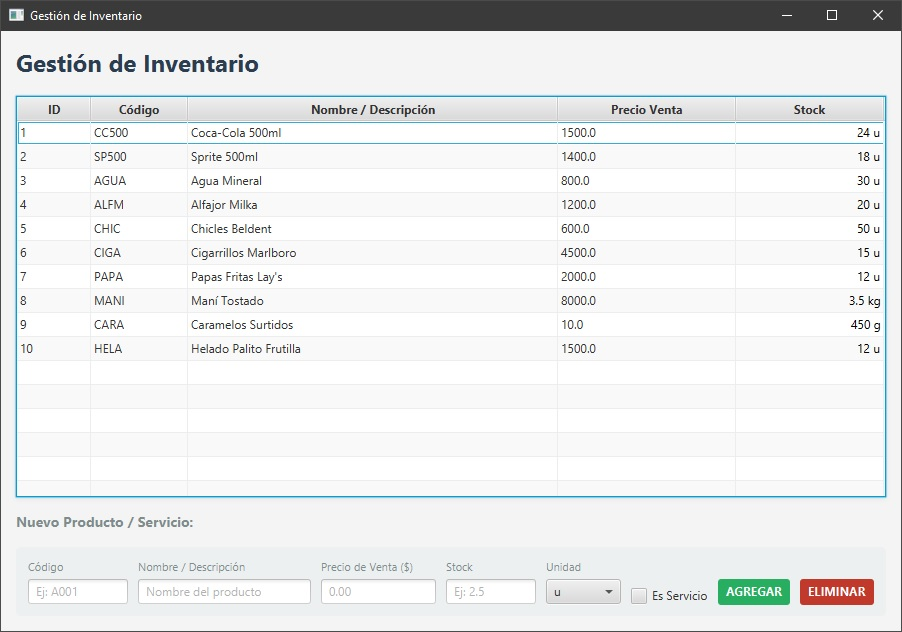
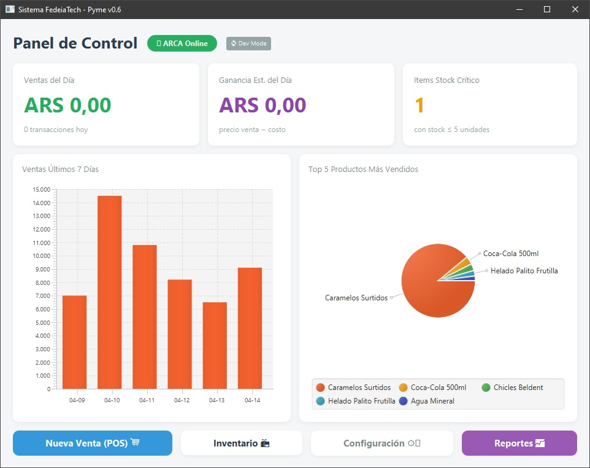
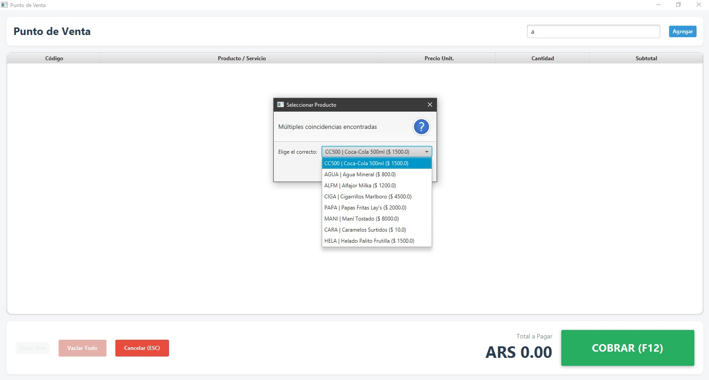

# Ferrematica — by FedeiaTech

**Sistema de Gestión Comercial para Ferrematica.**  
*Offline-First, orientado a comercios minoristas. Preparado para integración fiscal ARCA. Sincroniza stock/precio con el catálogo compartido de Ferrematica (Supabase) para alimentar la tienda online.*

**Estado:** v1.1.0 — Producción | **Licencia:** Propietaria  
**Autor:** Federico Iacono — IATech / FedeiaTech  
**Contacto:** iaconofede@gmail.com

**Descarga:** [fedeiatech.com/descargas](https://fedeiatech.com/descargas) *(próximamente)*



---

## Características

- **Punto de Venta (POS):** Facturación rápida con búsqueda por código/nombre, validación de stock en tiempo real y atajos de teclado.
- **Motor de Tickets PDF:** Generación de comprobantes con logo, datos de empresa y guardado temporal o permanente. Soporte para impresoras térmicas.
- **Gestión de Inventario:** Alta y baja de productos físicos y servicios con control de stock visual por colores.
- **Reportes:** Historial de ventas con opción de reimprimir cualquier ticket anterior.
- **Configuración de Empresa:** Nombre, CUIT, dirección, logo, mensaje de ticket, backup y restore de base de datos.
- **Base de Datos Local:** SQLite — funciona sin conexión a internet. Sin servidores externos.
- **Sincronización con Ferrematica Online:** push periódico (u on-demand) de stock/precio hacia el catálogo compartido de Supabase, para que la tienda online muestre disponibilidad real. Opt-in, solo ADMIN, con validación de códigos antes de sincronizar.

---

## Stack Tecnológico

| Componente | Tecnología |
| --- | --- |
| Lenguaje | Java 21 LTS |
| UI | JavaFX 21 + FXML + JFoenix |
| Build | Maven 3.9+ |
| Base de datos | SQLite (xerial JDBC) |
| PDF | OpenPDF |
| Excel | Apache POI 5.2.5 |

---

## Estado de Módulos

- [x] **Punto de Venta (POS)** — transacción atómica, stock, ticket PDF, ajuste de cantidades en carrito
- [x] **Motor de Tickets PDF** — logo, datos empresa, guardado permanente/temporal
- [x] **Dashboard con KPIs y Gráficos** — ventas del día, ganancia estimada, stock crítico, BarChart 7 días, PieChart top 5
- [x] **Gestión de Inventario** — CRUD completo con unidades (u/kg/g/lt) y categoría por ítem (taxonomía libre con sugerencias por perfil de negocio)
- [x] **Configuración y Persistencia** — empresa, backup/restore
- [x] **Reportes con Export Excel** — resumen diario, por producto y detalle completo filtrado por período
- [x] **Importación Masiva Excel** — plantilla descargable, validación por fila, resumen pre-confirmación y detección de duplicados
- [x] **Login y Roles de Usuario** — BCrypt, roles ADMIN/CAJERO, panel de gestión de usuarios, inventario read-only para cajeros
- [x] **Temas de color** — 6 colores de fondo (3 claros + 3 saturados), persiste entre sesiones, accesible para todos los roles
- [x] **Sistema de Combos** — combos basados en inventario con stock calculado automáticamente, visibles en negrita en inventario y vendibles desde POS
- [x] **Estadísticas Avanzadas** — canasta de productos (market basket), mejores horarios de venta, mapa de demanda día/hora
- [x] **Sincronización con Supabase** — push de stock/precio al catálogo compartido, con detección de bajas (tombstones) y programación automática configurable
- [ ] **Conexión Fiscal ARCA** *(planificado post comercialización)*

---

## Funcionalidades

Sistema de instalación única para Ferrematica — todas las funciones están disponibles desde el primer arranque, sin niveles de licencia ni desbloqueos.

| Feature | Disponible |
| --- | --- |
| Punto de Venta (POS) | ✓ |
| Inventario (solo lectura para CAJERO) | ✓ |
| Tickets PDF | ✓ |
| Dashboard con KPIs y gráficos | ✓ |
| Temas de color | ✓ |
| Gestión de Inventario completa (ADMIN) | ✓ |
| Reportes e historial de ventas | ✓ |
| Export Excel (3 formatos) | ✓ |
| Import masivo desde Excel | ✓ |
| Sistema de Combos | ✓ |
| Estadísticas Avanzadas (canasta, horarios, heatmap) | ✓ |
| Gestión de Usuarios (panel admin) | ✓ |
| Sincronización de stock con Ferrematica Online | ✓ |
| Conexión Fiscal ARCA | — *(próximo)* |

---

## Cómo ejecutar (Desarrollo)

**Requisitos:** JDK 21 + Maven 3.9+

```bash
# Clonar y ejecutar
git clone https://github.com/FedeiaTech/ferrematica-pos.git
cd ferrematica-pos
mvn javafx:run
```

La base de datos `gestion_pyme.db` se crea automáticamente en la raíz del proyecto al primer arranque.

---

## Capturas

| Punto de Venta | Gestión de Inventario |
| --- | --- |
|  |  |

---

## Changelog

### v1.1.0 — 2026-08-07

- **Compras de mercadería:** nueva ventana para registrar reposición de stock — elegís un producto existente del inventario, cargás cantidad, costo unitario y proveedor (opcional), y el sistema suma el stock y actualiza el costo del producto en una sola transacción atómica. Rechaza combos y servicios (no tienen compra directa). Historial de compras con LEFT JOIN — sobrevive aunque el producto se borre después.
- **Balances (Dashboard):** nueva pestaña dentro del Dashboard (ahora con solapas) — ventas menos compras del período, semanal o mensual, con carga perezosa (no consulta nada hasta que la abrís). Solo ADMIN.
- **Atajo de teclado en el POS:** `Ctrl+Enter` cobra la venta sin soltar el teclado; el botón COBRAR muestra el atajo como recordatorio en letra chica.
- **Autocompletado en vivo en el POS:** sugerencias de productos y combos mientras escribís en el buscador (mínimo 2 caracteres), navegable con flechas y Enter o con el mouse.
- **Gestión de categorías en Inventario:** renombrar una categoría existente o eliminarla (reasigna en bloque los productos a "A asignar", nunca borra productos).
- **Inventario:** campo "Descripción" real editable desde el form (antes solo se usaba en el import de Excel), botón "Duplicar" producto, unidades nuevas "docena" y "par".
- **Reportes:** borrar un ticket individual (antes solo se podía borrar todo el historial), re-autenticación con contraseña admin.
- **Fix:** el total mensual en Reportes/Estadísticas venía inflado por un JOIN duplicado contra el detalle de cada venta — cualquier ticket con más de un producto se contaba de más.
- **Fix:** sacado el override manual de "margen de ganancia" en Configuración — la ganancia estimada del Dashboard siempre se calcula por el costo real de cada producto, evitando números que no reflejaban la mezcla real de ventas.
- **Sync manual:** click en el indicador "Sync" del Dashboard dispara una sincronización con Supabase al toque (antes solo corría por el intervalo automático configurado).
- **Deuda técnica:** el buscador del POS migró de cargar toda la tabla de productos en memoria a una consulta SQL filtrada — impacto notorio a partir de varios cientos de productos.

### v1.0.0 — 2026-08-04

- **De-fork a build dedicado Ferrematica:** eliminado todo el modelo freemium/premium (`LicenseService`, `PerfilNegocio`) — esta copia queda 100% desbloqueada desde el primer arranque, sin niveles de licencia. El producto multi-tenant original sigue existiendo sin cambios en su repositorio propio.
- **Sincronización con Supabase:** nuevo `SupabaseSyncService` — push periódico (o manual desde Config) de stock/precio/nombre al catálogo compartido `products`, autenticado como cuenta dedicada (nunca con la anon key desnuda). Detecta y bloquea la sincronización si hay códigos de producto en blanco o duplicados. Empuja bajas como `is_active=false` (tombstones) en vez de intentar borrar filas remotas.
- **Indicador de sincronización en el Dashboard:** estado visual (gris/naranja/verde) junto al indicador de ARCA, con la hora de la última sincronización exitosa — persiste entre reinicios.
- **Ventanas modales:** todas las ventanas secundarias (Inventario, POS, Reportes, Config, Usuarios, Estadísticas) ahora bloquean el Dashboard mientras están abiertas — ya no se puede operar en dos ventanas en simultáneo.
- **Fix:** el botón "Sincronizar ahora" guarda la configuración antes de sincronizar (antes exigía guardar, cerrar y reabrir Config a mano).
- **Fix:** los tombstones de baja fallaban en silencio contra Supabase (violación de `NOT NULL` en `name`) — detectado en pruebas manuales contra un proyecto real, corregido y cubierto con test.

### v0.9.0 — 2026-07-28

- **Logging centralizado:** reemplaza los `printStackTrace()`/catch silenciosos reales por un logger a archivo (`logs/app.log`), para poder diagnosticar fallos en instalaciones de clientes.
- **Diálogos de alerta centralizados:** `AlertUtil` reemplaza 5 implementaciones casi idénticas de `mostrarAlerta` repartidas en distintos controllers. Dashboard y Estadísticas ahora avisan al usuario cuando falla la carga de un gráfico (antes quedaba en silencio).
- **`ConexionDB` thread-safe:** `getConexion()` sincronizado para eliminar una carrera check-then-act.
- **Primeros tests automatizados:** JUnit 5 contra SQLite real (sin mocks), cubriendo CRUD de inventario, la transacción atómica de venta (descuento de stock) y la idempotencia de la migración de configuración.
- **Categoría de producto:** campo libre con sugerencias, para clasificar el inventario por rubro sin imponer una taxonomía rígida.
- **Perfil de Negocio:** kiosco, tienda, ferretería o genérico, configurable desde Configuración. Define qué categorías se sugieren en Inventario — no cambia el modelo de datos ni la lógica de negocio.

### v0.8.1 — 2026-05-05
- Diálogo "Acerca de" con autoría, versión y contacto en el dashboard
- LEEME.pdf generado automáticamente al primer arranque (fondo negro, instrucciones básicas)
- Botones "Leeme" y "Acerca de" en el header del dashboard
- Configuración: logo acepta PNG, JPG, BMP y TIFF; restauración muestra ruta exacta
- Borrar ventas con confirmación de contraseña admin
- ScrollPane en cada pestaña de configuración
- Dashboard se refresca automáticamente al cerrar Configuración e Inventario
- Config avanzada: ancho de ticket 58/80mm, mostrar/ocultar dirección y CUIT, redondeo a enteros, margen de ganancia % configurable, limpieza de tickets PDF, ubicación de DB

### v0.8.0 — 2026-05-04

- **Sistema de Combos:** combos compuestos por ítems del inventario. Stock calculado automáticamente como mínimo de componentes disponibles. Visible en inventario en negrita/púrpura. Vendible desde POS igual que productos. Al vender un combo se descuenta el stock de cada componente.
- **Estadísticas Avanzadas:** nueva ventana con 3 pestañas: canasta de productos (market basket, pares co-ocurrentes en tickets), mejor horario de venta (BarChart por hora), mapa de demanda (grilla 7×24 horas coloreada por intensidad).
- **Modelo Freemium/Premium:** reportes, estadísticas, combos y gestión de usuarios son funciones PREMIUM. Unlock único por contraseña desde botón en dashboard. Estado persiste en DB entre sesiones.
- **Clave de activación:** `fedeiatech2024` *(cambiar antes de distribución comercial)*

### v0.7.2 — 2026-04-17

- **Temas de color:**
  - 6 colores de fondo seleccionables desde el dashboard: Blanco, Azul claro, Verde claro, Azul, Lavanda, Crema.
  - Accesible para todos los roles (ADMIN y CAJERO).
  - El color elegido persiste entre sesiones (guardado en tabla `configuracion`).

### v0.7.1 — 2026-04-16

- **Login y Roles:**
  - Pantalla de login con BCrypt. Usuario por defecto: `admin` / `admin`.
  - Roles ADMIN y CAJERO: CAJERO solo accede al POS e inventario en modo lectura.
  - Panel de gestión de usuarios (ADMIN): crear, cambiar contraseña, cambiar rol, eliminar. Validaciones: no autoeliminar, no eliminar último admin.
  - `LicenseService` reemplaza el flag estático por delegación a `SessionService`.

### v0.7.0 — 2026-04-16

- **Inventario — Importación masiva desde Excel:**
  - Botón "Descargar Plantilla" genera un `.xlsx` con encabezados y fila de ejemplo en gris/itálico.
  - Botón "Importar Excel" abre selector de archivo, valida cada fila y muestra resumen expandible antes de confirmar.
  - Errores cubiertos: campo vacío, tipo inválido, NaN/Infinito, valor negativo, error de celda/fórmula, unidad desconocida.
  - Si hay productos con código ya existente: diálogo para Actualizar / Saltar / Cancelar (decisión global).
  - Botón "?" muestra el formato de columnas y valores válidos.
  - `ItemDAO.buscarPorCodigo()` para detección de duplicados antes de insertar.

### v0.6.1 — 2026-04-15

- **POS — Gestión de cantidades en carrito:**
  - Doble-click sobre una fila abre diálogo para ajustar cantidad (pre-cargado con valor actual). Ingresar ≤ 0 elimina la línea.
  - Nuevo botón "Vaciar Todo" con confirmación. Se habilita solo cuando hay ítems en el carrito.
- **Reportes — Export a Excel:**
  - Botón "Exportar Excel" con selector de período (DatePicker desde/hasta) y tres tipos de reporte:
    - *Resumen diario*: una fila por día con cantidad de ventas y total ARS.
    - *Por producto*: unidades vendidas y total por ítem en el período.
    - *Detalle completo*: una fila por ítem vendido con precio unitario y subtotal.
  - Encabezados en negrito, formato numérico `#,##0.00`, auto-filtro y columnas auto-dimensionadas.
- **Datos demo:** primer arranque con DB vacía carga automáticamente 10 productos de kiosco y 25 ventas históricas de ejemplo.

### v0.6.0 — 2026-04-15

- **FASE 1 — Dashboard KPIs y Gráficos:**
  - Tarjeta "Ventas del Día" ahora incluye contador de transacciones.
  - Nueva tarjeta "Ganancia Estimada del Día" (precio venta − costo, solo productos físicos).
  - Nueva tarjeta "Items Stock Crítico" (productos con stock ≤ 5, con semáforo visual).
  - BarChart con ventas de los últimos 7 días.
  - PieChart con top 5 productos más vendidos por unidades.
  - `VentaDAO`: 5 nuevos métodos de agregación SQL.

### v0.5.2 — 2026-04-15

- **Fix:** Edición de productos en Inventario. Seleccionar una fila puebla el formulario y activa el modo edición. El botón cambia a ACTUALIZAR. CANCELAR restaura el estado inicial.

### v0.5.1 — 2026-04-15

- **Fix:** `ConfiguracionDAO` — los campos `certificado_ruta` y `ruta_backup` se perdían en cada guardado de configuración. El UPDATE ahora incluye todos los campos del modelo y preserva los valores sin UI.

### v0.5 — 2026-04-13

- Finalización módulo POS y generación de Tickets PDF.
- MVP Estable inicial.

---

*© 2026 FedeiaTech — Todos los derechos reservados.*
